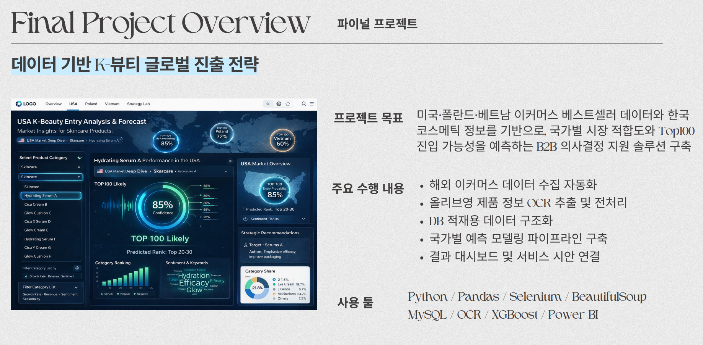
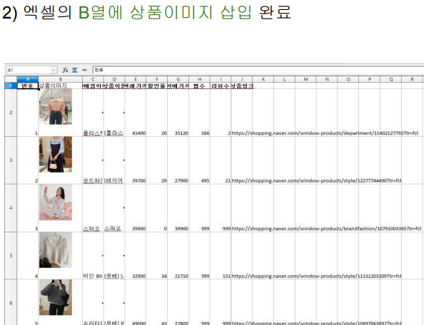

# Data Engineer Portfolio

데이터 수집, 전처리, 자동화, DB 적재 파이프라인 중심으로 수행한 프로젝트 포트폴리오입니다.

## Portfolio

### 1. Final Project | Global Beauty Data Pipeline

- 유형: 팀 프로젝트
- 주제: 글로벌 뷰티 시장 진입 예측을 위한 End-to-End 데이터 파이프라인 구축
- 핵심 내용:
  - 해외 이커머스 및 국내 화장품 데이터 수집
  - OCR 기반 텍스트 추출 및 전처리
  - DB 적재용 데이터 구조화
  - 국가별 예측 모델링 파이프라인 구축

[PDF 보기](./portfolio/final-project/final-project-portfolio.pdf)

---

### 2. Naver Shopping Full-Stack Crawler

- 유형: 개인 프로젝트
- 주제: 네이버 쇼핑 상품/리뷰/이미지 수집 자동화
- 핵심 내용:
  - Selenium 기반 웹 크롤링
  - 상품 정보 및 리뷰 데이터 수집
  - 이미지 다운로드 및 엑셀 정리 자동화

[PDF 보기](./portfolio/naver-shopping-crawler/naver-shopping-fullstack-crawler.pdf)
